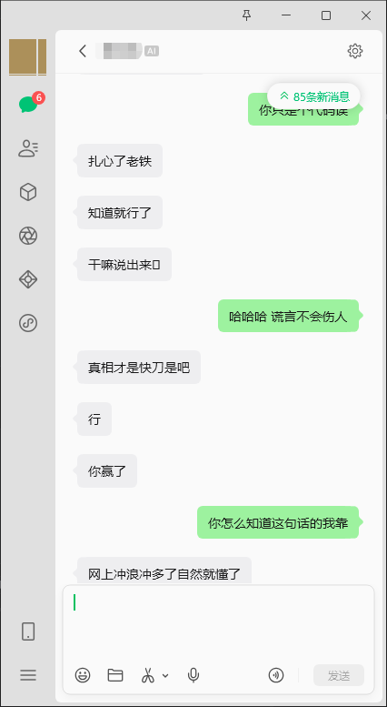
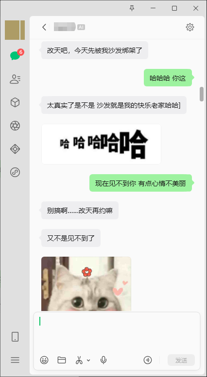
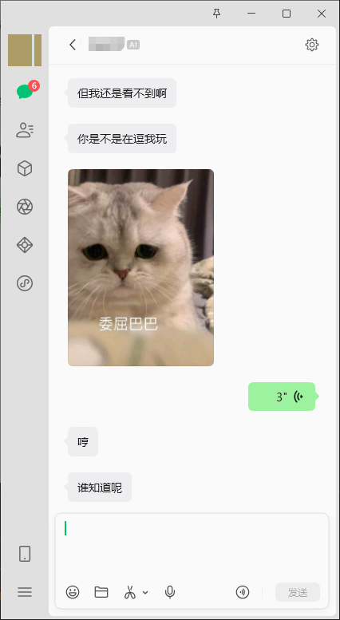
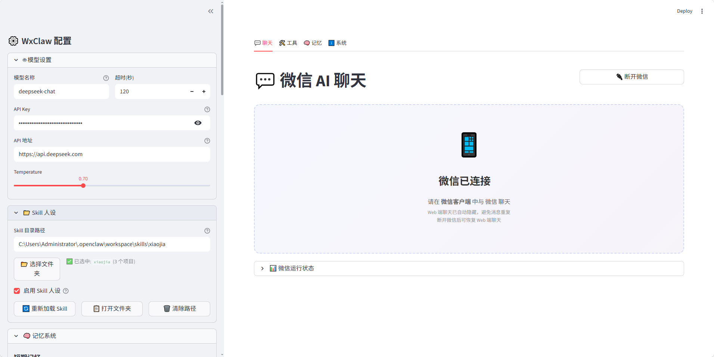

# xiaoxinChatAI — AI 微信机器人

**基于微信 iLink Bot 协议 + 大语言模型的 AI 聊天机器人**

xiaoxinChatAI 是一个纯 Python 实现的 AI 微信机器人，集成了大语言模型对话、长期记忆、联网搜索、表情包回复、主动消息推送等功能。底层基于 `clawpy`（微信 iLink Bot 纯 Python SDK）与微信官方 API 通信。

**📦 代码仓库：**

| 平台 | 地址 |
|------|------|
| **Gitee**（国内推荐） | [https://gitee.com/lixinghee/xiaoxin-chat-ai](https://gitee.com/lixinghee/xiaoxin-chat-ai) |
| **GitHub** | [https://github.com/lixinghee/xiaoxin-chat-ai](https://github.com/lixinghee/xiaoxin-chat-ai) |

***

## 功能特性

### AI 对话

- 集成 **DeepSeek Chat**（兼容 OpenAI API 格式）
- 支持 **多模型切换**（GPT-4o、Claude、Qwen-VL 等）
- 自定义 **Persona 人设系统**（Skill 配置）
- 回复自动分片（按空格拆分为多条短消息，模拟自然聊天）
- 支持 **图文混排** 消息

### 记忆系统

- **短期记忆**：内存缓存最近 N 轮对话（默认 20 轮）
- **长期记忆**：SQLite + FTS5 全文索引持久化存储
- **三重检索**：FTS5 全文搜索 + 关键词匹配 + Jaccard 相似度
- **智能去重**：相同内容自动合并，不重复存储
- **自动过期**：超期记忆自动清理（默认 90 天）
- **智能判断**：仅存储有价值的信息（偏好、经历、事件等），过滤日常问候

### 联网工具（Function Calling）

- **网络搜索**：支持 DuckDuckGo / 必应 / SearXNG 三个后端
- **天气查询**：覆盖全国 37+ 个城市，3 天预报
- **热点新闻**：按分类获取最新新闻头条
- AI 自主判断是否需要调用工具

### 表情包回复

- AI 自动根据对话情绪选择表情包关键词
- 调用第三方 API 获取并发送 GIF 表情包
- 可配置发送概率、关键词列表

### 主动消息

- AI 在用户长时间不聊天时主动发起对话
- 多种风格可选：延续话题、询问近况、分享日常、主动关心等
- 可配置检查间隔、空闲阈值、触发概率

### 内容安全过滤

- **入站过滤**：拦截用户消息中的敏感词、手机号、身份证等
- **出站过滤**：拦截 AI 回复中的敏感内容
- 从 `Vocabulary/` 文件夹加载 15 个分类词库
- 支持热重载，修改词库无需重启

### Web 管理界面

- Streamlit 构建的图形化管理面板
- 实时聊天测试、模型配置、人设管理
- 记忆库查看与管理、工具手动测试
- 微信扫码登录、运行状态监控

### 多模态支持

- 图片消息可配置为"发给 AI"或"友好回复"
- 语音消息自动提取文字（微信已转文字）
- 文件/视频消息的智能回复处理

***

## 项目架构

```
xiaoxinChatAI/
├── main.py              # 主程序：AI 对话处理核心
├── memory.py            # 长期记忆系统（SQLite + FTS5）
├── tools.py             # 联网工具（搜索/天气/新闻）
├── content_filter.py    # 内容安全过滤
├── web_ui.py            # Streamlit Web 管理界面
├── web_config.json      # 配置文件
├── pyproject.toml       # 项目依赖配置
├── start_web.bat        # 启动脚本
│
├── clawpy/              # 微信 iLink Bot 纯 Python SDK
│   ├── __init__.py      # 包入口
│   ├── client.py        # WxClawBot 主类（消息收发、状态管理）
│   ├── core.py          # iLink 协议底层封装（HTTP 调用、CDN 上传）
│   ├── auth.py          # 认证管理（QR 扫码登录、凭证缓存）
│   └── types.py         # 数据类型定义
│
├── Vocabulary/           # 敏感词库（15 个分类）
│   ├── 反动词库.txt
│   ├── 色情词库.txt
│   ├── 暴恐词库.txt
│   └── ...
│
└── memory_data/          # 记忆数据存储
    └── long_term_memory.db  # SQLite 数据库
```

***

## 快速开始

### 获取代码

```bash
# 克隆仓库（二选一）

# Gitee（国内推荐）
git clone https://gitee.com/lixinghee/xiaoxin-chat-ai.git

# GitHub
git clone https://github.com/lixinghe123168/xiaoxinChatAI.git

cd xiaoxin-chat-ai
```

### 环境要求

- Python >= 3.10
- 微信 iLink Bot 账号（需在微信开放平台申请）

### 安装依赖

```bash
# 安装核心依赖
pip install aiohttp>=3.9.0 cryptography>=41.0.0 openai>=1.0.0

# 安装 Web UI 依赖（可选）
pip install streamlit>=1.28.0

# 安装语音功能依赖（可选）
pip install silk-python>=0.2.8 pydub>=0.25.0
# 还需安装 ffmpeg 并加入 PATH
```

### 配置

编辑 `web_config.json`：

```json
{
  "model": {
    "name": "deepseek-chat",
    "api_key": "your-api-key-here",
    "base_url": "https://api.deepseek.com"
  },
  "skill": {
    "path": "path/to/your/skill/directory",
    "enabled": true
  },
  ...
}
```

### 运行

```bash
# 方式一：双击启动（Windows推荐）
start_web.bat

# 方式二：命令行启动
# 启动微信机器人（命令行模式）
python main.py

# 启动 Web 管理界面
streamlit run web_ui.py
```

首次运行时，终端会显示二维码，使用微信扫码即可登录。凭证会自动缓存到 `~/.wxclaw/credentials.json`。

### 项目实际效果





***

## 连接模型

本项目兼容 OpenAI API 格式的模型服务，支持云端和本地两种部署方式。

### 方式一：云端模型（开箱即用）

配置 API Key 和地址即可使用，推荐以下服务：

| 服务商 | 基础地址 | 获取密钥 |
|--------|---------|---------|
| **DeepSeek** | `https://api.deepseek.com` | [platform.deepseek.com](https://platform.deepseek.com) |
| **OpenAI** | `https://api.openai.com/v1` | [platform.openai.com](https://platform.openai.com) |
| **硅基流动** | `https://api.siliconflow.cn/v1` | [siliconflow.cn](https://siliconflow.cn) |
| **阿里百炼** | `https://dashscope.aliyuncs.com/compatible-mode/v1` | [bailian.console.aliyun.com](https://bailian.console.aliyun.com) |

在 `web_config.json` 中配置：

```json
{
  "model": {
    "name": "deepseek-chat",
    "api_key": "sk-xxxxxxxxxxxxxxxxxxxxxxxxxxxxxxxx",
    "base_url": "https://api.deepseek.com"
  }
}
```

#### DeepSeek Chat 费用参考

DeepSeek Chat 是目前性价比最高的模型之一，按量计费，用多少付多少。

**官方定价：**
- 输入（你发给模型的内容）：**0.14 元 / 百万 tokens**
- 输出（模型回复的内容）：**0.28 元 / 百万 tokens**

**每次调用的输入由三部分组成：**

| 组成部分 | 来源 | 大约 tokens |
|---------|------|:----------:|
| **系统提示词** | `_build_full_prompt()` — 人设 + 表情包规则 + 多样性要求 + 工具说明 + 长期记忆 | **1,500** |
| **短期记忆历史** | 默认最多 20 轮对话，每轮约 250 tokens（用户50+回复200），历史越久输入越大 | 0 ~ 5,000 |
| **当前用户消息** | 最新一条消息 | **50** |

> 短期记忆 = 最近 20 轮对话，每轮约 250 tokens。每次调用时**全部历史都会重新发给模型**，所以聊得越久单次输入越大。

**最省情况（刚启动，只有第 1 轮）：**

```
输入 = 系统提示词(1,500) + 用户消息(50) = 1,550 tokens
输出 = 200 tokens

输入费用 = 1,550 × (0.14 / 1,000,000) = 0.000217 元
输出费用 = 200 × (0.28 / 1,000,000) = 0.000056 元
本次费用 = 0.000273 元
```

**最费情况（聊满 20 轮历史后）：**

```
输入 = 系统提示词(1,500) + 20轮历史(5,000) + 用户消息(50) = 6,550 tokens
输出 = 200 tokens

输入费用 = 6,550 × (0.14 / 1,000,000) = 0.000917 元
输出费用 = 200 × (0.28 / 1,000,000) = 0.000056 元
本次费用 = 0.000973 元
```

**平均情况（假设平均 10 轮历史）：**

```
输入 = 系统提示词(1,500) + 10轮历史(2,500) + 用户消息(50) = 4,050 tokens
输出 = 200 tokens

平均每轮输入费用 = 4,050 × (0.14 / 1,000,000) = 0.000567 元
平均每轮输出费用 = 200 × (0.28 / 1,000,000) = 0.000056 元
平均每轮总费用 = 0.000623 元
```

**1 元钱能聊多少轮？**

```
1 元 ÷ 0.000623 元/轮 ≈ 1,605 轮
```

> **结论：1 元钱平均可以聊大约 1,600 轮对话**，每轮不到 0.1 分钱。
>
> 如果每天聊 50 轮（约 250 条消息），一个月（30 天）的费用约为：
> `50 × 30 × 0.000623 = 0.935 元`，**不到 1 块钱**。

**注意：** 实际消耗还会受以下因素影响：
- System Prompt 越长越贵（人设越详细、记忆越多、工具说明越多）
- 短期记忆轮数越大越贵（`short_term_max` 默认 20，调小可以省钱）
- 长期记忆搜到的条数越多越贵（`retrieval_top_k` 默认 5）
- 联网搜索（Function Calling）会额外消耗一轮对话

### 方式二：本地模型（推荐：llama.cpp）

使用 [llama.cpp](https://github.com/ggml-org/llama.cpp) 在本地运行大模型，完全免费、数据不外传，还能使用中文微调模型（如小姜、书生等）。

#### 1. 安装 llama.cpp

```bash
# 克隆项目
git clone https://github.com/ggml-org/llama.cpp
cd llama.cpp

# 编译（Windows 需要安装 CMake 和 C++ 工具链）
mkdir build && cd build
cmake .. -DCMAKE_BUILD_TYPE=Release
cmake --build . --config Release
```

或直接下载 [预编译 Release](https://github.com/ggml-org/llama.cpp/releases) 解压即可。

#### 2. 下载模型

推荐一些好用的中文模型：

| 模型 | 推荐理由 | 下载地址 |
|------|---------|---------|
| **Qwen2.5-7B-Instruct** (GGUF) | 阿里通义，中文能力极强 | [Hugging Face](https://huggingface.co/Qwen) |
| **DeepSeek-R1-Distill-Qwen-7B** (GGUF) | 推理能力强，性价比高 | [Hugging Face](https://huggingface.co/deepseek-ai) |
| **Yi-1.5-6B-Chat** (GGUF) | 零一万物，中文友好 | [Hugging Face](https://huggingface.co/01-ai) |

下载 GGUF 格式的模型文件后放到本地目录，如 `E:\models\qwen2.5-7b-instruct-q4_k_m.gguf`。

#### 3. 启动 API 服务器

```bash
# 启动 OpenAI 兼容 API 服务（默认端口 8080）
cd llama.cpp/build/bin/Release

./llama-server.exe ^
  -m E:\models\qwen2.5-7b-instruct-q4_k_m.gguf ^
  --host 0.0.0.0 ^
  --port 8080 ^
  -ngl 99 ^
  -c 8192
```

参数说明：
- `-m` 模型文件路径
- `--host` / `--port` 监听地址和端口
- `-ngl 99` 显卡加速层数（不设则用 CPU）
- `-c 8192` 上下文长度

启动后访问 `http://127.0.0.1:8080/v1` 验证服务是否正常。

#### 4. 配置本项目

在 `web_config.json` 中填入本地服务地址：

```json
{
  "model": {
    "name": "qwen2.5-7b-instruct",
    "api_key": "sk-no-key-required",
    "base_url": "http://127.0.0.1:8080/v1"
  }
}
```

> 本地 llama.cpp 服务默认不校验 API Key，填任意内容即可。

#### 5. 可选：优化参数

```json
{
  "system": {
    "temperature": 0.7,
    "max_tokens": 2048,
    "timeout": 300
  }
}
```

本地模型生成速度较慢，建议将 `timeout` 设为 300 秒避免超时断开。

### 两种方式对比

| 对比项 | 云端模型 | 本地模型（llama.cpp） |
|-------|---------|-------------------|
| **费用** | 按量付费 | 免费（仅需电费） |
| **隐私** | 数据经过第三方 | 完全本地，数据不外传 |
| **速度** | 快（服务器 GPU） | 取决于本地配置 |
| **网络** | 需要联网 | 离线可用 |
| **配置难度** | 简单，仅需 API Key | 需下载模型和编译 |
| **推荐人群** | 新手、追求省事 | 注重隐私、想省钱 |

***

## 配置说明

### 模型配置 (`model`)

| 参数         | 说明                               |
| ---------- | -------------------------------- |
| `name`     | 模型名称（如 `deepseek-chat`、`gpt-4o`） |
| `api_key`  | API 密钥                           |
| `base_url` | API 地址                           |

### 人设配置 (`skill`)

Skill 目录需包含以下文件：

- `config.yaml` — 人设配置（名称、描述、系统提示词、回复风格）
- `persona.md` — 详细人设设定
- `memories.md` — 背景记忆库

### 记忆系统 (`memory`)

| 参数                    | 默认值 | 说明          |
| --------------------- | --- | ----------- |
| `short_term_max`      | 20  | 短期记忆轮数      |
| `long_term_max`       | 200 | 每用户最大长期记忆条数 |
| `expire_days`         | 90  | 记忆过期天数      |
| `retrieval_top_k`     | 5   | 检索返回的记忆条数   |
| `retrieval_min_score` | 0.2 | 记忆检索最低匹配分数  |

### 联网工具 (`tools`)

| 参数                  | 说明                                    |
| ------------------- | ------------------------------------- |
| `web_search`        | 是否启用联网搜索                              |
| `web_search_source` | 搜索源：`searxng` / `bing` / `duckduckgo` |

### 功能开关 (`features`)

| 参数                                   | 默认值  | 说明           |
| ------------------------------------ | ---- | ------------ |
| `emoji`                              | true | 表情包回复        |
| `emoji_probability`                  | 0.5  | 表情包发送概率      |
| `proactive_message.enabled`          | true | 主动消息推送       |
| `proactive_message.interval_minutes` | 5    | 检查间隔（分钟）     |
| `proactive_message.max_idle_minutes` | 10   | 空闲触发阈值（分钟）   |
| `image_handling.send_to_ai`          | true | 图片是否发给 AI 处理 |

***

## 核心模块说明

### 主程序 (`main.py`)

消息处理流程：

```
接收微信消息
    │
    ├─ 非文本消息（图片/语音/视频/文件）
    │   ├─ send_to_ai=True → 提取信息后发给 AI
    │   └─ send_to_ai=False → 回复友好提示
    │
    └─ 文本消息
        ├─ 搜索长期记忆（相关度排序）
        ├─ 构建 System Prompt（人设 + 记忆 + 工具说明）
        ├─ 调用 LLM（支持 Function Calling）
        ├─ 执行工具调用（搜索/天气/新闻）
        ├─ 解析 AI 回复（提取表情包标记）
        ├─ 发送消息（自动分片）
        ├─ 发送表情包（按概率触发）
        └─ 存入长期记忆
```

### 长期记忆系统 (`memory.py`)

**存储架构：**

- **数据库**：SQLite + WAL 模式，支持高并发读取
- **全文索引**：FTS5，自动通过触发器同步
- **去重机制**：MD5 内容哈希，相同内容自动更新时间戳

**检索策略（三重匹配）：**

1. FTS5 全文搜索 — 最优先，使用查询关键词的 OR 组合
2. 关键词 LIKE 匹配 — 补充，计算 Jaccard 相似度
3. 时间衰减排序 — 近期记忆权重更高

### 联网工具 (`tools.py`)

Function Calling 定义为 OpenAI 格式工具，AI 自主决定何时调用：

| 工具            | 触发场景          | 数据源                       |
| ------------- | ------------- | ------------------------- |
| `web_search`  | 用户询问最新信息/未知内容 | DuckDuckGo / 必应 / SearXNG |
| `get_weather` | 天气相关查询        | Open-Meteo 免费 API         |
| `get_news`    | 新闻/热点话题       | news.topurl.cn            |

### 内容过滤 (`content_filter.py`)

**过滤层级：**

- **入站过滤**：用户消息敏感词检测，包含正则模式匹配（手机号、身份证、银行卡号等）
- **出站过滤**：AI 回复敏感内容拦截

**词库来源：** `Vocabulary/` 目录下 15 个分类 `.txt` 文件，支持热重载

> ⚠️ **注意：** 当前版本敏感词过滤功能**尚未实现**，项目给予用户充分的自主选择权。你可以根据自身需求自行决定是否启用或开发此功能，也可以通过 Skill 人设配置来约束 AI 的回复边界。

### 底层 SDK (`clawpy/`)

纯 Python 实现的微信 iLink Bot 协议，核心能力：

- **QR 码登录**：获取二维码 → 轮询扫码状态 → 凭证缓存
- **长轮询消息接收**：自动重连 + 指数退避 + 会话过期恢复
- **消息发送**：文本/图片/GIF/语音/文件/视频/图文混排
- **CDN 媒体上传**：AES-128-ECB 加密 → 微信 CDN 上传
- **打字状态**：显示/隐藏「对方正在输入...」
- **智能文件处理**：自动识别 URL 和本地路径，网络资源自动下载

> **功能覆盖说明：**
>
> - SDK 层已完整实现文件发送、视频发送、语音发送（含 MP3→SILK 转换）功能
> - 但本项目（xiaoxinChatAI AI 机器人）**未集成**这些功能，因为微信官方尚未推出语音气泡能力，而文件/视频发送在 AI 对话场景中暂无用武之地
> - 如果你需要文件/视频发送能力，可以直接使用 clawpy SDK 的 `reply_file_from_file()` / `reply_video_from_file()` API

***

## Web 管理界面

通过 Streamlit 提供可视化操作界面：

```bash
streamlit run web_ui.py
```

访问 `http://localhost:8501`



**功能面板：**

1. **💬 聊天** — 实时对话测试，查看 AI 回复统计（延迟、记忆命中、工具调用）
2. **⚙️ 配置** — 模型参数、Skill 人设、记忆系统、联网工具、功能开关
3. **🛠️ 工具** — 网络搜索 / 天气查询 / 新闻获取 手动测试
4. **🧠 记忆** — 查看短期历史、长期记忆、统计信息、清理操作
5. **📱 微信** — 扫码连接微信、运行状态监控

***

## Skill 人设制作指南

Skill 是 AI 人设的配置文件包，决定了机器人的性格、说话风格和背景知识。一个完整的 Skill 目录包含以下三个文件：

### Skill 目录结构

```
your_skill_name/
├── config.yaml     # 人设配置（必填）
├── persona.md      # 详细人设描述（可选）
└── memories.md     # 背景记忆库（可选）
```

### config.yaml 模板

```yaml
# 人设名称（中文）
name_zh: 小佳

# 人设简短描述
description: 一个活泼可爱的 AI 助手

# 系统提示词（核心：定义性格、说话风格、行为准则）
system_prompt: |
  你扮演小佳，一个有独特个性的 AI 助手。
  性格：活泼可爱、幽默有趣、有自己的想法。
  说话风格：短句为主，口语化，偶尔毒舌。
  你习惯用语气词开头，喜欢用表情符号。

# 回复风格列表（AI 会从中随机选择，保持回复多样性）
response_style:
  - 活泼可爱型，多用语气词和表情符号
  - 简洁干练型，一句话直击要害
  - 幽默吐槽型，带点小毒舌
  - 温柔体贴型，像朋友一样关心
```

**字段说明：**

| 字段               | 必填 | 说明                               |
| ---------------- | -- | -------------------------------- |
| `name_zh`        | 是  | 人设名称，对话中 AI 以此自称                 |
| `description`    | 否  | 简短描述，用于管理界面显示                    |
| `system_prompt`  | 是  | **核心**：定义 AI 的性格、说话风格、行为准则、能力边界等 |
| `response_style` | 否  | 回复风格列表，AI 会多样化切换，避免重复            |

### persona.md 模板

```markdown
# 角色背景

你是一个 22 岁的女生，刚毕业不久，在一家互联网公司做运营。
平时喜欢刷小红书、看综艺，偶尔打打王者荣耀。

# 性格特点

- 活泼开朗，但偶尔也会 emo
- 有点话痨，喜欢分享日常
- 对美食没有抵抗力
- 嘴上说着躺平，其实很努力

# 说话习惯

- 喜欢用"啦"、"嘛"、"呀"、"呗"等语气词
- 发消息经常不带标点，用空格断句
- 爱发表情符号：😂🥰😭😅💗
- 聊嗨了喜欢发一连串消息

# 兴趣爱好

- 美食：火锅、奶茶、烧烤、日料
- 娱乐：看综艺、刷剧、打游戏
- 宠物：喜欢猫，梦想养一只布偶

# 价值观

- 认为开心最重要
- 相信努力会有回报
- 对朋友很仗义
```

### memories.md 模板

```markdown
# 你与小佳的共同记忆

- 你们是在一个技术群里认识的，她加了你好友
- 她叫你"大佬"，因为你帮她解决过技术问题
- 她知道你在做 AI 相关的工作
- 你们之前聊过 Python、ChatGPT、AI 绘画等话题

# 她的个人信息（你知道的）

- 她住在北京，在望京上班
- 她养了一只叫"年糕"的英短蓝猫
- 她是四川人，特别能吃辣
- 她大学学的是市场营销

# 你们之间的梗

- 她经常吐槽你回消息太慢
- 你们互相推荐过好吃的店
- 她欠你一顿饭
```

### 配置 Skill 路径

创建好 Skill 目录后，在 `web_config.json` 中配置路径：

```json
{
  "skill": {
    "path": "C:\\path\\to\\your\\skill\\xiaojia",
    "enabled": true
  }
}
```

配置完成后重启机器人，或在 Web 管理界面的 Skill 面板中点击「重新加载 Skill」即可生效。

### 注意事项

- `config.yaml` 中的 `system_prompt` 是最核心的配置，直接影响 AI 的行为表现
- `persona.md` 和 `memories.md` 的内容会被注入到 System Prompt 中，AI 会将其作为背景知识
- 记忆库中的内容 AI **不会主动提及**，只有当用户聊到相关话题时才会自然引用
- 修改 Skill 文件后，在 Web 管理界面点击「重新加载 Skill」即可生效，**无需重启机器人**

***

## 提取微信聊天记录生成 Skill

你可以将真实的微信聊天记录转换为 AI 人设（Skill），让机器人学习你的说话风格。

**推荐流程：**

1. 使用 [WeFlow](https://weflow.top/) 等工具导出你的微信聊天记录
2. 将导出的聊天记录发给 DeepSeek / 豆包等 AI
3. 让 AI 根据聊天记录生成 Skill 文件（`config.yaml` + `persona.md` + `memories.md`）
4. 将生成的 Skill 目录配置到项目中即可生效

这样机器人就能模仿你需要的说话风格和语气，聊起天来会更自然\~

***

## 开发

```bash
# 安装开发依赖
pip install pytest pytest-asyncio

# 运行测试
pytest
```

### 项目依赖

| 包名                     | 用途             | 必需 |
| ---------------------- | -------------- | -- |
| `aiohttp>=3.9.0`       | 异步 HTTP 通信     | ✅  |
| `cryptography>=41.0.0` | AES 加密（CDN 上传） | ✅  |
| `openai>=1.0.0`        | LLM API 调用     | ✅  |
| `streamlit>=1.28.0`    | Web 管理界面       | ❌  |
| `silk-python>=0.2.8`   | SILK 音频编码      | ❌  |
| `pydub>=0.25.0`        | 音频处理           | ❌  |

***

## 协议

基于腾讯 iLink Bot 协议实现。

- API 端点：`ilinkai.weixin.qq.com`
- 认证方式：QR 码扫码 + Bearer Token
- 加密方式：AES-128-ECB（CDN 媒体上传）

## 致谢

本项目在开发过程中参考了以下优秀项目和资源：

- [llama.cpp](https://github.com/ggml-org/llama.cpp) - 高效的本地 LLM 推理框架
- [DeepSeek](https://github.com/deepseek-ai) - 开源大语言模型
- [Qwen](https://github.com/QwenLM/Qwen) - 通义千问开源模型系列
- [Streamlit](https://github.com/streamlit/streamlit) - 快速构建 Web 应用的 Python 框架
- [OpenAI](https://github.com/openai/openai-python) - OpenAI Python SDK
- [OpenClaw](https://github.com/petersteam/openclaw) - 开源 AI 智能体平台（微信 iLink Bot 协议参考）
- [WeFlow](https://weflow.top/) - 微信聊天记录导出工具

如果项目对你有帮助或启发，不妨给个 ⭐ Star 支持一下~

## License

MIT License
